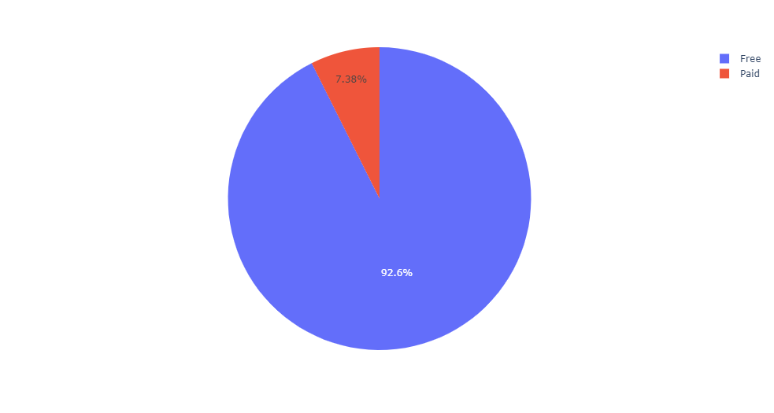
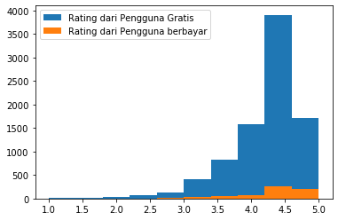

# Classification Rating in App Store

## About This Project
this is a project that performs exploratory data analysis, data cleaning to data modeling. To get insight I use visualization techniques so that it can be easily understood by humans. An example of the insight I got after doing the visualization technique is that users prefer to download free applications rather than paid applications. 

and I also divide users into several groups ranging from people aged 10 years to adults in order to get detailed insight into some users. The purpose of this project is to find out and make predictions using machine learning about the characteristics of people who rate an application.

## Technology and dataset Used

1. Machine Learning
   - [Python](https://www.python.org/)
   - [SVM](https://scikit-learn.org/stable/modules/svm.html)
   - [XGBoost](https://scikit-learn.org/stable/modules/generated/sklearn.ensemble.GradientBoostingClassifier.html)
   - [Logistic Regression](https://scikit-learn.org/stable/modules/generated/sklearn.linear_model.LogisticRegression.html)
   - [KNN](https://scikit-learn.org/stable/modules/generated/sklearn.neighbors.KNeighborsClassifier.html)
   - [Random Forest](https://scikit-learn.org/stable/modules/generated/sklearn.ensemble.RandomForestClassifier.html)
2. Dataset
   - [Kaggle.com](https://www.kaggle.com/datasets/faridansutariya/google-playstore-dataset) 
